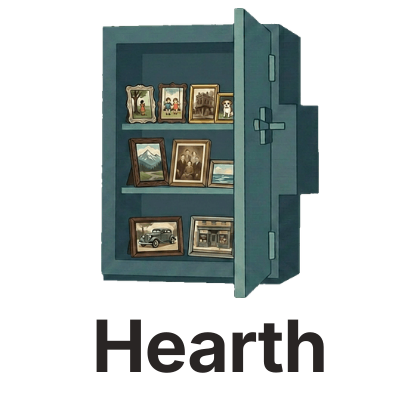

  

<h3 align="center">Hearth — your family's self-hosted photo and video album</h3>

---

## About

Hearth is a self-hosted photo and video management server for a private family album: everyone in the family backs up their photos to one place, and face recognition, people, and memories can be shared between family members who trust each other.

**Hearth is a modified version of [Immich](https://github.com/immich-app/immich)**, and is used and distributed under the terms of the [GNU Affero General Public License v3.0](LICENSE). Hearth is an independent project: it is **not affiliated with, endorsed by, or supported by** the Immich project or FUTO. "Immich" is a trademark of its respective owner; it is used here only to credit the upstream project this software is based on.

## Modifications from upstream Immich

This fork was created in August 2026 from Immich v3.1.0. Notable changes (see the git history and [releases](../../releases) for exact dates and details):

- **Partner face recognition sharing** (August 2026): an admin toggle plus a per-partner checkbox that lets a user share their face recognition data — the people tagged in their photos, including names and birthdays — with chosen partners. Shared people appear on partner photos, on the People page, and in search filters.
- **Family-album trust model** (August 2026): partner access is intentionally broad; when a partner is authorized, they can see the people data on shared photos by design.
- **Fork versioning and release pipeline** (August 2026): the fork carries its own version (shown in the app), and releases publish version-tagged container images.
- **Rebranding to Hearth** (August 2026): new name, logo, and visual identity, replacing upstream branding.
- Infrastructure changes for independent CI and image publishing on this repository.

## Source code and license

- The complete source code for every published release is available in this repository; each release tag (for example `v1.1.0`) corresponds exactly to the published container images with the same tag.
- The software is licensed under the [GNU AGPL v3.0](LICENSE). If you run a modified version of this software for users over a network, the AGPL requires you to offer those users access to the corresponding source code — the About screen in the app links to this repository for that purpose.
- All upstream copyright notices are retained. Copyright for the original work belongs to the Immich authors.

## Installation

Hearth ships as Docker images built from this repository:

- `ghcr.io/rshaker2-ops/hearth-server`
- `ghcr.io/rshaker2-ops/hearth-machine-learning`

A Docker Compose file for Unraid (and general Docker hosts) is provided in [`docker/docker-compose.unraid.yml`](docker/docker-compose.unraid.yml) with [`docker/example.unraid.env`](docker/example.unraid.env). Pin `IMMICH_VERSION` to a release tag (for example `v1.1.0`) for reproducible upgrades.

The mobile experience uses the official Immich mobile apps from the app stores, pointed at your Hearth server; this project does not distribute mobile applications.

### A note on configuration naming

Internal identifiers — environment variables such as `IMMICH_VERSION`, API routes, and the database schema — intentionally keep upstream Immich's naming. This preserves compatibility with the official Immich mobile apps and upstream documentation, and keeps future upstream updates tractable. Only the user-facing identity is rebranded.

## Upstream project

Immich's documentation largely applies to Hearth and is an excellent resource: <https://docs.immich.app/>. If you want the original project — with official support, a community, and mobile apps — use [Immich](https://github.com/immich-app/immich) and consider [supporting its development](https://buy.immich.app/).
